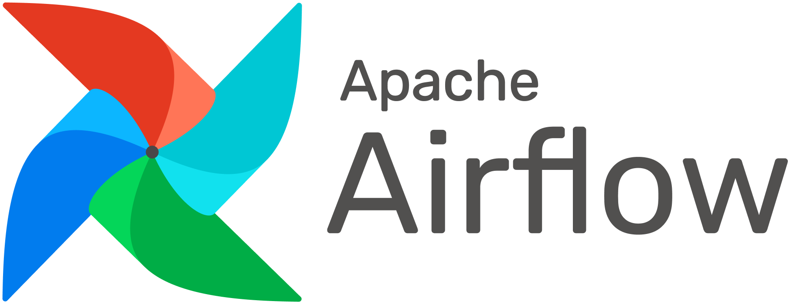

# Get started developing workflows with Apache Airflow

[Apache
Airflow](https://airflow.apache.org/ "Apache Airflow - Documentation")
is an open-source tool for orchestrating complex computational workflows
and data processing pipelines. If you find yourself running cron task
which execute ever longer scripts, or keeping a calendar of big data
processing batch jobs then Airflow can probably help you. This tutorial
provides an introduction to get started writing pipelines with Airflow.

An Airflow workflow is designed as a directed acyclic graph (DAG). That
means, that when authoring a workflow, you should think how it could be
divided into tasks which can be executed independently. You can then
merge these tasks into a logical whole by combining them into a graph.

## An example Airflow pipeline DAG

The shape of the graph decides the overall logic of your workflow. An
Airflow DAG can include multiple branches and you can decide which of
them to follow and which to skip at the time of workflow execution.

This creates a very resilient design, because each task can be retried
multiple times if an error occurs. Airflow can even be stopped entirely
and running workflows will resume by restarting the last unfinished
task.

When designing Airflow operators, it’s important to keep in mind that
they may be executed more than once. Each task should be
[idempotent](https://en.wikipedia.org/wiki/Idempotence "Idempotence - Wikipedia"),
i.e. have the ability to be applied multiple times without producing
unintended consequences.

## Airflow nomenclature

Here is a brief overview of some terms used when designing Airflow
workflows:

- Airflow **DAGs** are composed of **Tasks**.
- Each Task is created by instantiating an **Operator** class. A
  configured instance of an Operator becomes a Task, as in:
  `my_task = MyOperator(...)`.
- When a DAG is started, Airflow creates a **DAG Run** entry in
  its database.
- When a Task is executed in the context of a particular DAG Run, then
  a **Task Instance** is created.
- `AIRFLOW_HOME` is the directory where you store your DAG definition
  files and Airflow plugins.

&nbsp;

| When?               | DAG     | Task           | Info about other tasks                                                                                          |
| ------------------- | ------- | -------------- | --------------------------------------------------------------------------------------------------------------- |
| _During definition_ | DAG     | Task           | [`get_flat_relatives`](https://airflow.apache.org/_modules/airflow/models.html#BaseOperator.get_flat_relatives) |
| _During a run_      | DAG Run | Task Instance  | [`xcom_pull`](https://airflow.incubator.apache.org/concepts.html#xcoms "Apache Airflow - Xcoms")                |
| _Base class_        | `DAG`   | `BaseOperator` |                                                                                                                 |

&nbsp;

Airflow documentation provides more information about these and other
[concepts](https://airflow.apache.org/concepts.html "Apache Airflow - Concepts").

## Prerequisites

Airflow is written in Python, which is installed on your machine. We are using Python 2, but Airflow is supported on Python 3 as well.

## Start Airflow

To start Airflow you can type the following:

    start-airflow.sh

Then you need to change your working directory to the `AIRFLOW_HOME` directory where your DAG
definition files and Airflow plugins will be stored.

    cd $AIRFLOW_HOME

You can also see Airflow's configuration file `airflow.cfg` in `AIRFLOW_HOME`.
Existing configuration values stored in `airflow.cfg` will be fine for
this tutorial, but in case you want to tweak any Airflow settings, this
is the file to change. Take a look at the docs for more information
about [configuring Airflow](https://airflow.apache.org/docs/apache-airflow/1.10.14/configurations-ref.html "Apache Airflow - Configuration").

You should be able to run Airflow commands. Let’s try by issuing the
following:

    airflow version
    ...
    1.10.14

Airflow’s UI is provided in the form of a Flask web application.
You can now visit the Airflow UI by navigating your browser to port
`8080` on the host where Airflow was started:
<http://localhost:8080/admin/>

## Your first Airflow DAG

OK, everything is ready, let’s start writing some code. We’ll start
by creating a Hello World workflow, which does nothing other then
sending “Hello world!” to the log.

Your `dags_folder`, that is the directory where your DAG
definition files will be stored in `AIRFLOW_HOME/dags`. Inside that
directory create a file named `hello_world.py`.

    airflow_home
    ├── airflow.cfg
    ├── dags                <- Your DAGs directory
    │   └── hello_world.py  <- Your DAG definition file
    └── unittests.cfg

Add the following code to `dags/hello_world.py`:

```py
from datetime import datetime
from airflow import DAG
from airflow.operators.dummy_operator import DummyOperator
from airflow.operators.python_operator import PythonOperator

def print_hello():
    return 'Hello world!'

dag = DAG('hello_world', description='Simple tutorial DAG',
          schedule_interval='0 12 * * *',
          start_date=datetime(2017, 3, 20), catchup=False)

dummy_operator = DummyOperator(task_id='dummy_task', retries=3, dag=dag)

hello_operator = PythonOperator(task_id='hello_task', python_callable=print_hello, dag=dag)

dummy_operator >> hello_operator
```

This file creates a simple DAG with just two operators, the
`DummyOperator`, which does nothing and a `PythonOperator` which calls
the `print_hello` function when its task is executed.

## Running your DAG

In order to run your DAG, first you have to wait a bit for Airflow to pick it up and show it in it's GUI. When you refresh the Airflow UI in your browser, you should see your
`hello_world` DAG listed in Airflow UI.

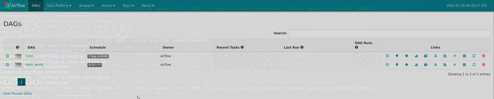

When Airflow first picks up a new DAG it will be in the paused state as indicated by the `Off` switch on the left of the DAG name. Also, you will see other DAGs that have been previously been developed and picked up. In the above screenshot, there is a previous DAG called `hello`.

Click on the `Off` switch next to `hello_world` to unpause your DAG.

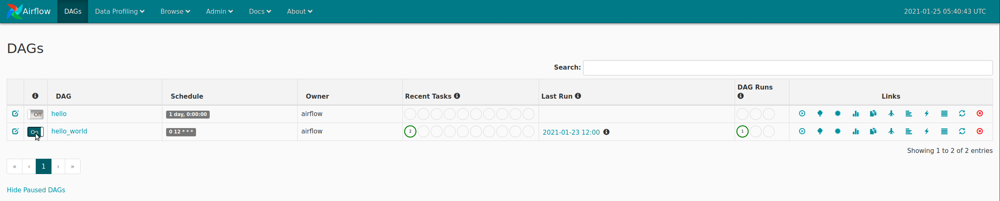

Once you unpause your DAG, the Airflow scheduler will start sending tasks for execution.
The default Airflow settings rely on an executor named `SequentialExecutor`,
which is started automatically by the scheduler. In production you would probably
want to use a more robust executor, such as the `CeleryExecutor`.
In our setup we have changed `airflow.cfg` to use `LocalExecutor`.

Now, if you click on your DAG name (`hello_world`) you will see the following:

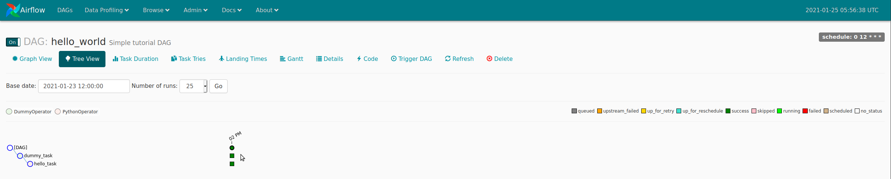

This is the `Tree View`. Each column represents a run of the DAG. The circle represents the state of the whole DAG run and the squares represent the state of each task run. The various states are color coded: Green for `success`, red for `failed` etc. You can see the meanings of the colors in the top right part of the view.

You can also click on `Graph View` on the top left to switch to the `Graph View`. Here the DAG is shown as a graph where the tasks are the nodes and the dependencies between them are the edges.

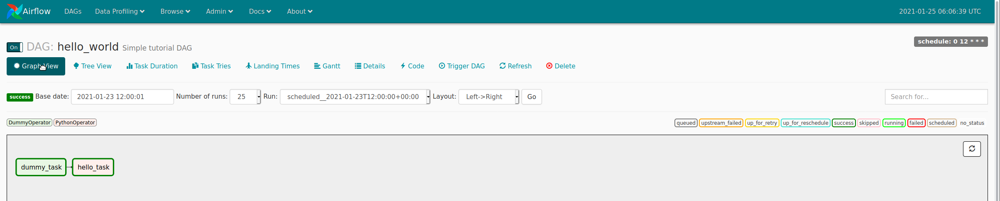

You can also view the code of the DAG by clicking on the `Code` button.

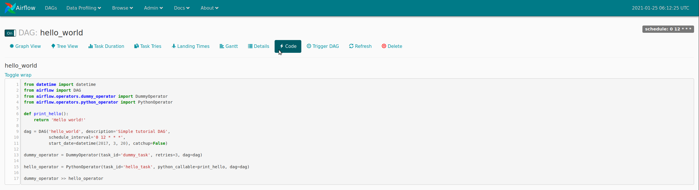

From either `Tree View` or `Graph View` you can view the log of each task run. To do this, you first click on the task

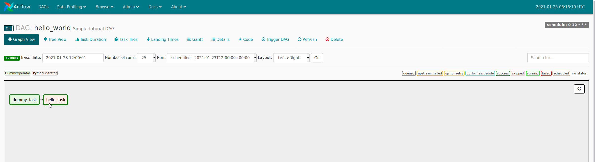

Then you click on `View Log`

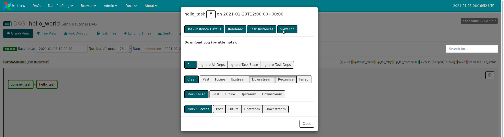

This brings you to this page where you can see the log for the particular task (hello_task):

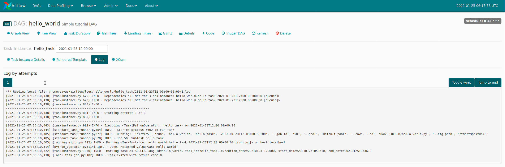

## Your first Airflow Operator

Let’s start writing our own Airflow operators. An Operator is an atomic
block of workflow logic, which performs a single action. Operators are
written as Python classes (subclasses of `BaseOperator`), where the
`__init__` function can be used to configure settings for the task and a
method named `execute` is called when the task instance is executed.

Any value that the `execute` method returns is saved as an Xcom message
under the key `return_value`. We’ll cover this topic later.

The `execute` method may also raise the `AirflowSkipException` from
`airflow.exceptions`. In such a case the task instance would transition
to the Skipped status.

If another exception is raised, the task will be retried until the
maximum number of `retries` is reached.

> Remember that since the `execute` method can retry many times, it should
> be [idempotent](https://en.wikipedia.org/wiki/Idempotence "Idempotence - Wikipedia").

We’ll create your first operator in an Airflow plugin file named
`plugins/my_operators.py`. First create the `airflow_home/plugins`
directory, then add the `my_operators.py` file with the following
content:

```py
import logging

from airflow.models import BaseOperator
from airflow.plugins_manager import AirflowPlugin
from airflow.utils.decorators import apply_defaults

log = logging.getLogger(__name__)

class MyFirstOperator(BaseOperator):

    @apply_defaults
    def __init__(self, my_operator_param, *args, **kwargs):
        self.operator_param = my_operator_param
        super(MyFirstOperator, self).__init__(*args, **kwargs)

    def execute(self, context):
        log.info("Hello World!")
        log.info('operator_param: %s', self.operator_param)

class MyFirstPlugin(AirflowPlugin):
    name = "my_first_plugin"
    operators = [MyFirstOperator]
```

In this file we are defining a new operator named `MyFirstOperator`. Its
`execute` method is very simple, all it does is log “Hello World!” and
the value of its own single parameter. The parameter is set in the
`__init__` function.

We are also defining an Airflow plugin named `MyFirstPlugin`. By
defining a plugin in a file stored in the `airflow_home/plugins`
directory, we’re providing Airflow the ability to pick up our plugin and
all the operators it defines. We’ll be able to import these operators
later using the line `from airflow.operators import MyFirstOperator`.

In the docs, you can read more about [Airflow
plugins](https://airflow.apache.org/docs/apache-airflow/1.10.14/plugins.html "Apache Airflow - Plugins").

Now, we’ll need to create a new DAG to test our operator. Create a
`dags/test_operators.py` file and fill it with the following content:

```py
from datetime import datetime
from airflow import DAG
from airflow.operators.dummy_operator import DummyOperator
from airflow.operators import MyFirstOperator

dag = DAG('my_test_dag', description='Another tutorial DAG',
          schedule_interval='0 12 * * *',
          start_date=datetime(2017, 3, 20), catchup=False)

dummy_task = DummyOperator(task_id='dummy_task', dag=dag)

operator_task = MyFirstOperator(my_operator_param='This is a test.',
                                task_id='my_first_operator_task', dag=dag)

dummy_task >> operator_task
```

Here we just created a simple DAG named `my_test_dag` with a
`DummyOperator` task and another task using our new `MyFirstOperator`.
Notice how we pass the configuration value for `my_operator_param` here
during DAG definition.

At this stage your source tree will look like this:

    airflow_home
    ├── airflow.cfg
    ├── dags
    │   └── hello_world.py
    │   └── test_operators.py  <- Second DAG definition file
    ├── plugins
    │   └── my_operators.py    <- Your plugin file
    └── unittests.cfg

To test your new operator, you should stop (CTRL-C) and restart your
Airflow web server and scheduler. In your terminal type

    stop-airflow.sh
    start-airflow.sh

Afterwards, go back to the Airflow UI, turn on the `my_test_dag` DAG and trigger a run.
Take a look at the logs for `my_first_operator_task`.

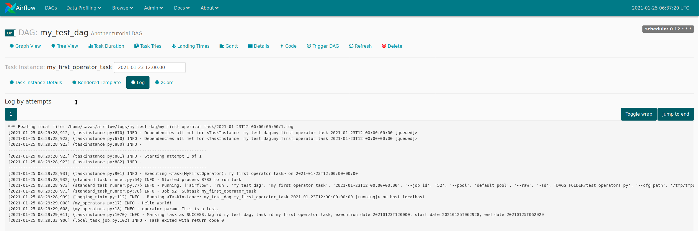

## Debugging an Airflow operator

Debugging would quickly get tedious if you had to trigger a DAG run and
wait for all upstream tasks to finish before you could retry your new
operator. Thankfully Airflow has the `airflow test` command, which you
can use to manually start a single operator in the context of a specific
DAG run.

The command takes 3 arguments: the name of the dag, the name of a task
and a date associated with a particular DAG Run.

    airflow test my_test_dag my_first_operator_task 2021-01-24T18:00:00.0

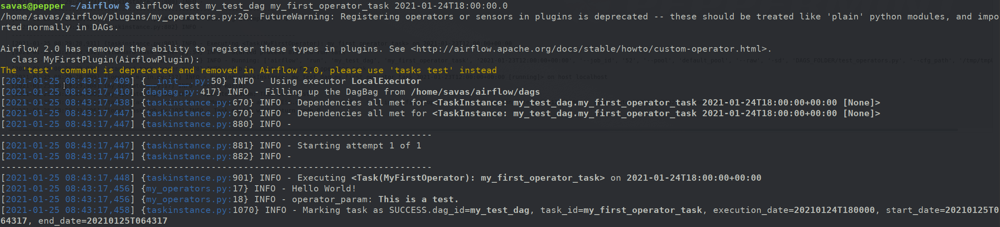

You can use this command to restart you task as many times as needed,
while tweaking your operator code.

> If you want to test a task from a particular DAG run, you can find the
> needed date value in the logs of a failing task instance.

## Debugging an Airflow operator with IPython

There is a cool trick you can use to debug your operator code.
You can place IPython’s `embed()` command in your code, for example
in the `execute` method of an operator, like so:

```py
def execute(self, context):
    log.info("Hello World!")

    from IPython import embed; embed()

    log.info('operator_param: %s', self.operator_param)
```

Now when you run the `airflow test` command again:

    $ airflow test my_test_dag my_first_operator_task 2017-03-18T18:00:00.0

the task will run, but execution will stop and you will be dropped into
an IPython shell, from which you can explore the place in the code where
you placed `embed()`:

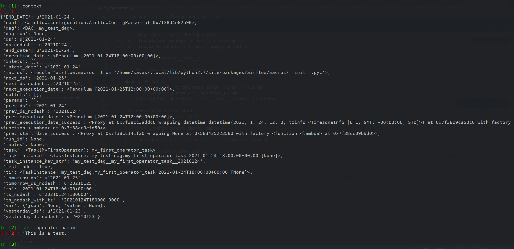

You could of course also drop into [Python’s interactive
debugger](https://docs.python.org/2.7/library/pdb.html "pdb - The Python Debugger")
`pdb` (`import pdb; pdb.set_trace()`) or the [IPython enhanced
version](https://pypi.python.org/pypi/ipdb "IPython-enabled pdb") `ipdb`
(`import ipdb; ipdb.set_trace()`).

## Your first Airflow Sensor

An Airflow Sensor is a special type of Operator, typically used to
monitor a long running task on another system.

To create a Sensor, we define a subclass of `BaseSensorOperator` and
override its `poke` function. The `poke` function will be called over
and over every `poke_interval` seconds until one of the following
happens:

- `poke` returns `True` - if it returns `False` it will be
  called again.
- `poke` raises an `AirflowSkipException` from `airflow.exceptions` -
  the Sensor task instance’s status will be set to Skipped.
- `poke` raises another exception, in which case it will be retried
  until the maximum number of `retries` is reached.

There are many [predefined
sensors](https://github.com/apache/airflow/tree/master/airflow/sensors "Airflow Sensors on Github"),
which can be found in Airflow’s codebase:

To add a new Sensor to your `my_operators.py` file, add the following
code:

```py
from datetime import datetime
from airflow.operators.sensors import BaseSensorOperator

class MyFirstSensor(BaseSensorOperator):

    @apply_defaults
    def __init__(self, *args, **kwargs):
        super(MyFirstSensor, self).__init__(*args, **kwargs)

    def poke(self, context):
        current_minute = datetime.now().minute
        if current_minute % 3 != 0:
            log.info("Current minute (%s) not is divisible by 3, sensor will retry.", current_minute)
            return False

        log.info("Current minute (%s) is divisible by 3, sensor finishing.", current_minute)
        return True
```

Here we created a very simple sensor, which will wait until the the
current minute is a number divisible by 3. When this happens, the
sensor’s condition will be satisfied and it will exit. This is a
contrived example, in a real case you would probably check something
more unpredictable than just the time.

Remember to also change the plugin class, to add the new sensor to the
`operators` it exports:

```py
class MyFirstPlugin(AirflowPlugin):
    name = "my_first_plugin"
    operators = [MyFirstOperator, MyFirstSensor]
```

Final code should look like this:

```py
import logging
from datetime import datetime
from airflow.models import BaseOperator
from airflow.plugins_manager import AirflowPlugin
from airflow.utils.decorators import apply_defaults
from airflow.operators.sensors import BaseSensorOperator

log = logging.getLogger(__name__)


class MyFirstOperator(BaseOperator):

    @apply_defaults
    def __init__(self, my_operator_param, *args, **kwargs):
        self.operator_param = my_operator_param
        super(MyFirstOperator, self).__init__(*args, **kwargs)

    def execute(self, context):
        log.info("Hello World!")
        log.info('operator_param: %s', self.operator_param)


class MyFirstSensor(BaseSensorOperator):
    template_fields = tuple()
    ui_color = '#b5f2ff'

    @apply_defaults
    def __init__(self, *args, **kwargs):
        super(MyFirstSensor, self).__init__(*args, **kwargs)

    def poke(self, context):
        current_minute = datetime.now().minute
        if current_minute % 3 != 0:
            log.info("Current minute (%s) not is divisible by 3, sensor will retry.", current_minute)
            return False

        log.info("Current minute (%s) is divisible by 3, sensor finishing.", current_minute)
        return True


class MyFirstPlugin(AirflowPlugin):
    name = "my_first_plugin"
    operators = [MyFirstOperator, MyFirstSensor]
```

You can now place the operator in your DAG:

```py
from datetime import datetime
from airflow import DAG
from airflow.operators.dummy_operator import DummyOperator
from airflow.operators import MyFirstOperator, MyFirstSensor


dag = DAG('my_test_dag', description='Another tutorial DAG',
          schedule_interval='0 12 * * *',
          start_date=datetime(2017, 3, 20), catchup=False)

dummy_task = DummyOperator(task_id='dummy_task', dag=dag)

sensor_task = MyFirstSensor(task_id='my_sensor_task', poke_interval=30, dag=dag)

operator_task = MyFirstOperator(my_operator_param='This is a test.',
                                task_id='my_first_operator_task', dag=dag)

dummy_task >> sensor_task >> operator_task
```

> Restart your webserver and scheduler and try out your new workflow.

After you run the new DAG, if you click **View log** of the `my_sensor_task` task, you should see
something similar to this:

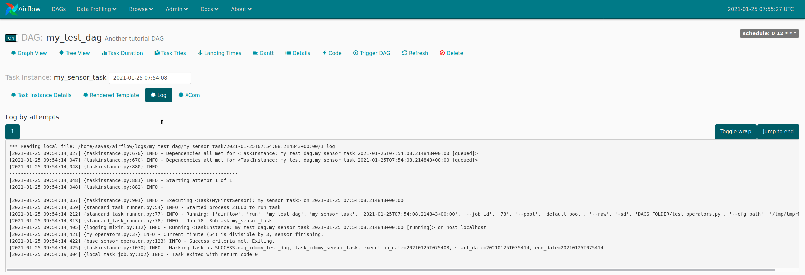

## Communicating between operators with Xcom

In most workflow scenarios downstream tasks will have to use some
information from an upstream task. Since each task instance will run in
a different process, perhaps on a different machine, Airflow provides a
communication mechanism called Xcom for this purpose.

Each task instance can store some information in Xcom using the
`xcom_push` function and another task instance can retrieve this
information using `xcom_pull`. The information passed using Xcoms will
be [pickled](https://docs.python.org/3/library/pickle.html "pickle - Python object serialization") and stored in the Airflow database (`xcom` table), so it’s better to
save only small bits of information, rather then large objects.

Let’s enhance our Sensor, so that it saves a value to Xcom. We’re using
the `xcom_push()` function which takes two arguments - a key under which
the value will be saved and the value itself.

<span>airflow_home/plugins/my_operators.py </span>

```py
class MyFirstSensor(BaseSensorOperator):
    ...

    def poke(self, context):
        ...
        log.info("Current minute (%s) is divisible by 3, sensor finishing.", current_minute)
        task_instance = context['task_instance']
        task_instance.xcom_push('sensors_minute', current_minute)
        return True
```

Now in our operator, which is downstream from the sensor in our DAG, we
can use this value, by retrieving it from Xcom. Here we’re using the
`xcom_pull()` function providing it with two arguments – the task ID of
the task instance which stored the value and the `key` under which the
value was stored.

<span>airflow_home/plugins/my_operators.py </span>

```py
class MyFirstOperator(BaseOperator):
    ...

    def execute(self, context):
        log.info("Hello World!")
        log.info('operator_param: %s', self.operator_param)
        task_instance = context['task_instance']
        sensors_minute = task_instance.xcom_pull('my_sensor_task', key='sensors_minute')
        log.info('Valid minute as determined by sensor: %s', sensors_minute)
```

Final version of the code is below:

```py
import logging
from datetime import datetime
from airflow.models import BaseOperator
from airflow.plugins_manager import AirflowPlugin
from airflow.utils.decorators import apply_defaults
from airflow.operators.sensors import BaseSensorOperator

log = logging.getLogger(__name__)


class MyFirstOperator(BaseOperator):

    @apply_defaults
    def __init__(self, my_operator_param, *args, **kwargs):
        self.operator_param = my_operator_param
        super(MyFirstOperator, self).__init__(*args, **kwargs)

    def execute(self, context):
        log.info("Hello World!")
        log.info('operator_param: %s', self.operator_param)
        task_instance = context['task_instance']
        sensors_minute = task_instance.xcom_pull('my_sensor_task', key='sensors_minute')
        log.info('Valid minute as determined by sensor: %s', sensors_minute)


class MyFirstSensor(BaseSensorOperator):
    template_fields = tuple()
    ui_color = '#b5f2ff'

    @apply_defaults
    def __init__(self, *args, **kwargs):
        super(MyFirstSensor, self).__init__(*args, **kwargs)

    def poke(self, context):
        current_minute = datetime.now().minute
        if current_minute % 3 != 0:
            log.info("Current minute (%s) not is divisible by 3, sensor will retry.", current_minute)
            return False

        log.info("Current minute (%s) is divisible by 3, sensor finishing.", current_minute)
        task_instance = context['task_instance']
        task_instance.xcom_push('sensors_minute', current_minute)
        return True


class MyFirstPlugin(AirflowPlugin):
    name = "my_first_plugin"
    operators = [MyFirstOperator, MyFirstSensor]
```

If you trigger a DAG run now and look in the operator’s logs, you will
see that it was able to display the value created by the upstream
sensor.

In the docs, you can read more about [Airflow
XComs](https://airflow.apache.org/docs/apache-airflow/1.10.14/concepts.html "Apache Airflow - Xcoms").

I hope you found this brief introduction to Airflow useful. Have fun
developing your own workflows and data processing pipelines!
