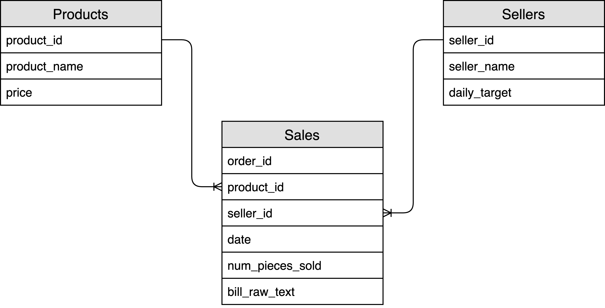

# Coursework

## Some challenging Spark SQL questions


Spark SQL is very easy to use, period. You might already know that it’s
also **quite** **difficult to master.**

To be proficient in Spark, one must have **three fundamental skills**:

1. The ability to **manipulate and understand the data**
2. The knowledge on **how to bend the tool** to the programmer’s needs
3. The art of finding **a balance among the factors that affect Spark jobs executions**

**The following six exercises resemble some typical situations that Spark developers face daily when building their pipelines:** these will help to assess the skills above.

## The Dataset

Let’s describe briefly the dataset that we are going to use: **it consists of three tables coming from the database of a shop, with products, sales and sellers.**

Data is available as a `zip` file that you can download from [here](https://drive.google.com/file/d/1MZ2Zb1c3KQYcmWZoOAO-zkFTzHlx5QzJ/view?usp=sharing) and save in your `/home/savas/data/coursework/` folder.

Now the data is downloaded in your VM as a zip file `/home/savas/data/coursework/coursework_data.zip`. Next you need to unzip the dataset using the command `unzip coursework_data.zip`. Once you do that, you will get the following three folders containing `snappy` compressed `parquet` files:

```text
products_parquet/
sales_parquet/
sellers_parquet/
```

> Note: Unzipping will take some time. Don't worry if your VM appears to be stuck for a while.

The following diagram shows how the tables can be connected:



## Sales Table

Each row in this table is an order and every order can contain only one
product. Each row stores the following fields:

- `order_id`: The **order ID**
- `product_id`: The single product sold in the order. **All orders have exactly one product**
- `seller_id`: The selling employee ID that sold the product
- `num_pieces_sold`: The **number of units sold for the specific product** in the order
- `bill_raw_text`: A string that represents the **raw text of the bill** associated with the order
- `date`: **The date** of the order.

## Products Table

Each row represents a **distinct product**. The fields are:

- `product_id`: The product ID
- `product_name`: The product name
- `price`: The product price

## Sellers Table

This table contains the **list of all the sellers**:

- `seller_id`: The seller ID
- `seller_name`: The seller name
- `daily_target`: The number of items (**regardless of the product type**) that the seller needs to hit
  his/her quota. For example, if the daily target is 100,000, the employee needs to sell 100,000 products he can hit the quota by selling 100,000 units of product_0, but also selling 30,000 units of product_1 and 70,000 units of product_2

## Exercises

The goal is to **implement a working code that solves the proposed problems**.

Tip: The dataset is built to allow working on a single machine: **when writing the code, imagine what would happen with a dataset 100 times bigger.**

There are four excercises and two warm-up questions. You are going to implement the warm-up questions and the exercises in Python using PySpark. You need to submit 6 files:

```
warmup_1.py
warmup_2.py
exercise_1.py
exercise_2.py
exercise_3.py
exercise_4.py
```

The above files should be able to be executed by `spark-submit`. For example, you should be able to run `spark-submit warmup_1.py` in your terminal and get some output.

You also need to submit one more file `report.doc` in Microsoft Word format. This will be the presentation of your work. You can structure the file as you like. The purpose of this is to describe your solution, your methodology, challenges you faced and how you solved them etc. Even if you don't solve an exercise, you will get points by describing what was the problem and your thoughts about a possible solution.

## Warm-up \#1

```py
# Find out how many orders, how many products and how many sellers are in the data.
# How many products have been sold at least once? Which is the product contained in more orders?

# Create the Spark session using the following code:
spark = SparkSession.builder \
    .master("local") \
    .config("spark.sql.autoBroadcastJoinThreshold", -1) \
    .config("spark.executor.memory", "500mb") \
    .appName("Exercise1") \
    .getOrCreate()
```

## Warm-up \#2

```py
# How many distinct products have been sold in each day?

# Create the Spark session using the following code:
spark = SparkSession.builder \
    .master("local") \
    .config("spark.sql.autoBroadcastJoinThreshold", -1) \
    .config("spark.executor.memory", "500mb") \
    .appName("Exercise1") \
    .getOrCreate()
```

## Exercise \#1

```py
# What is the average revenue of the orders?

# Create the Spark session using the following code:
spark = SparkSession.builder \
    .master("local") \
    .config("spark.sql.autoBroadcastJoinThreshold", -1) \
    .config("spark.executor.memory", "500mb") \
    .appName("Exercise1") \
    .getOrCreate()
```

## Exercise \#2

```py
# For each seller, what is the average % contribution of an order to the seller's daily quota?

# Example:
# If Seller_0 with `quota=250` has 3 orders:
# Order 1: 10 products sold
# Order 2: 8 products sold
# Order 3: 7 products sold
# The average % contribution of orders to the seller's quota would be:
# Order 1: 10/250 = 0.04
# Order 2: 8/250 = 0.032
# Order 3: 7/250 = 0.028
# Average % Contribution = (0.04+0.032+0.028)/3 = 0.03333

#Create the Spark session using the following code:
spark = SparkSession.builder \
    .master("local") \
    .config("spark.sql.autoBroadcastJoinThreshold", -1) \
    .config("spark.executor.memory", "500mb") \
    .appName("Exercise1") \
    .getOrCreate()
```

## Exercise \#3

```py
# Who are the second most selling and the least selling persons (sellers) for each product?
# Who are those for product with `product_id = 0`

# Create the Spark session using the following code:
spark = SparkSession.builder \
    .master("local") \
    .config("spark.sql.autoBroadcastJoinThreshold", -1) \
    .config("spark.executor.memory", "3gb") \
    .appName("Exercise1") \
    .getOrCreate()
```

## Exercise \#4

```py
# Create a new column called "hashed_bill" defined as follows:
# - if the order_id is even: apply MD5 hashing iteratively to the bill_raw_text field, once for each 'A' (capital 'A') present in the text. E.g. if the bill text is 'nbAAnllA', you would apply hashing three times iteratively (only if the order number is even)
# - if the order_id is odd: apply SHA256 hashing to the bill text
# Finally, check if there are any duplicate on the new column

#Create the Spark session using the following code
spark = SparkSession.builder \
    .master("local") \
    .config("spark.sql.autoBroadcastJoinThreshold", -1) \
    .config("spark.executor.memory", "3gb") \
    .appName("Exercise1") \
    .getOrCreate()
```
