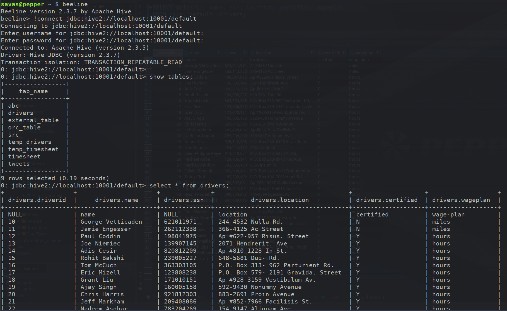

# How to Process Data with Apache Hive

## [Introduction](#introduction)

In this tutorial, we will use the HDFS file system to store
data files of truck drivers statistics. We will implement
[Hive](https://hive.apache.org/) queries to analyze, process
and filter that data.

## [Prerequisites](#prerequisites)

- You should first complete the tutorial on Pig so that the data files mentioned below are already uploaded to HDFS
- The Hive services should also be started. If not you can start them by typing `start-hive.sh` in your terminal

## [Outline](#outline)

- [Hive](#hive)
- [Hive or Pig?](#hive-or-pig)
- [Our Data Processing Task](#our-data-processing-task)
- [Download The Data](#download-the-data)
- [Upload The Data Files](#upload-the-data-files)
- [Hive and Pig Data Model Differences](#hive-and-pig-data-model-differences)
- [Create Table temp_drivers](#create-table-temp_drivers)
- [Create Query to Populate Hive Table temp_drivers with drivers.csv Data](#create-query-to-populate-hive-table-temp_drivers-with-drivers.csv-data)
- [Create Table drivers](#create-table-drivers)
- [Create Query to Extract Data from temp_drivers and Store It to drivers](#create-query-to-extract-data-from-temp_drivers-and-store-it-to-drivers)
- [Create temp_timesheet and timesheet tables similarly](#create-temp_timesheet-and-timesheet-tables-similarly)
- [Create Query to Group The Data (driverId, hours_logged, miles_logged)](#create-query-to-group-the-data-driverid-hours_logged-miles_logged)
- [Create Query to Join The Data (driverId, name, hours_logged, miles_logged)](#create-query-to-join-the-data-driverid-name-hours_logged-miles_logged)
- [Other SQL Clients](#other-sql-clients)
- [Summary](#summary)
- [Further Reading](#further-reading)

## [Hive](#hive)

Apache Hive is a component of Hadoop. Hive provides a SQL-like interface
to data stored in HDFS. In the previous tutorial, we used Pig, which is a
scripting language with a focus on dataflows. Hive provides a database
query interface to Apache Hadoop.

## [Hive or Pig?](#hive-or-pig)

People often ask why do both [Pig](https://pig.apache.org/) and
[Hive](https://hive.apache.org/) exist when they seem to do
much of the same thing. Hive is often used because of its SQL like query
language is used as the interface to an Apache Hadoop based data
warehouse. Hive is considered friendlier and more familiar to users who
are used to using SQL for querying data. Pig fits in through its data
flow strengths where it takes on the tasks of bringing data into Apache
Hadoop and working with it to get it into the form for querying. A good
overview of how this works is in Alan Gates posting on the Yahoo
Developer blog titled [Pig and Hive at
Yahoo!](https://yahoodevelopers.tumblr.com/post/85930551108/yahoo-betting-on-apache-hive-tez-and-yarn).
From a technical point of view, both Pig and Hive are feature complete,
so you can do tasks in either tool. However, you will find one tool or
the other will be preferred by the different groups that have to use
Apache Hadoop. The good part is they have a choice and both tools work
together.

## [Our Data Processing Task](#our-data-processing-task)

We are going to do the same data processing task as we just did with Pig
in the previous tutorial. We have several files of truck driver
statistics and we are going to bring them into Hive and do some simple
computing with them. We are going to compute the sum of hours and miles
logged driven by a truck driver for an year. Once we have the sum of
hours and miles logged, we will extend the script to translate a driver
id field into the name of the drivers by joining two different tables.

## [Download The Data](#download-the-data)

To download the driver data follow the instructions in the Pig tutorial.
Once you have the file you will need to unzip the file into a directory.
You should now have three csv files in your local folder.
We will be uploading two csv files - `drivers.csv` and `timesheet.csv` to HDFS.

## [Upload The Data Files](#upload-the-data-files)

To upload the data into HDFS, issue the following commands from your terminal:

```
hdfs dfs -put drivers.csv /pig_data
hdfs dfs -put timesheet.csv /pig_data
```

You can check that the files have been uploaded by navigating to http://localhost:50070/explorer.html#/pig_data from your browser


Let’s open the `hive shell` by typing `hive` in our terminal.
The `hive shell` provides a command-line interface to the Hive data warehouse system for
Hadoop.


## [Hive and Pig Data Model Differences](#hive-and-pig-data-model-differences)

Before we get started let’s take a look at how `Pig` and `Hive` data
models differ. In the case of Pig all data objects exist and are
operated on in the script. Once the script is complete all data objects
are deleted unless you stored them. In the case of Hive we are operating
on the Apache Hadoop data store. Any query you make, table that you
create, data that you copy persists from query to query. You can think
of Hive as providing a data workbench where you can examine, modify and
manipulate the data in Apache Hadoop. So when we perform our data
processing task we will execute it one query or line at a time. Once a
line successfully executes you can look at the data objects to verify if
the last operation did what you expected. All your data is live,
compared to Pig, where data objects only exist inside the script unless
they are copied out to storage. This kind of flexibility is Hive’s
strength. You can solve problems bit by bit and change your mind on what
to do next depending on what you find.

## [Create Table temp_drivers](#create-table-temp-drivers)

The first task we will do is create a table to hold the data. We will
type the query into the `hive>` prompt. Once you have typed in the query
hit `Enter` to execute it. Remember to always terminate all queries with `;`

> Note: The below queries drop the table first in case it exists from a previous run

```
DROP TABLE IF EXISTS temp_drivers;
CREATE TABLE IF NOT EXISTS temp_drivers (col_value STRING) STORED AS TEXTFILE;
```

The query does not return any results because at this point we just
created an empty table and we have not copied any data in it.


## [Create Query to Populate Hive Table temp_drivers with drivers.csv Data](#create-query-to-populate-hive-table-temp-drivers-with-driverscsv-data)

The next line of code will load the data file `drivers.csv` into the
table `temp_drivers`.

```
LOAD DATA INPATH '/pig_data/drivers.csv' OVERWRITE INTO TABLE temp_drivers;
```


After executing `LOAD DATA` we can see table `temp_drivers` was
populated with data from `drivers.csv`. Note that Hive consumed the data
file `drivers.csv` during this step. If you look in the `File Browser`
you will see drivers.csv is no longer there.

Let's take a quick peek at what is stored in our temp table:

```
SELECT * FROM temp_drivers;
```


## [Create Table drivers](#create-table-drivers)

Now that we have read the data in we can start working with it. The next
thing we want to do extract the data. So first we will type in a query
to create a new table called `drivers` to hold the data. That table will
have six columns for `driverId, name, ssn, location, certified` and the `wage-plan` of drivers.

```
DROP TABLE IF EXISTS drivers;
CREATE TABLE drivers (driverId INT, name STRING, ssn BIGINT, location STRING, certified STRING, wageplan STRING);
```


## [Create Query to Extract Data from temp_drivers and Store It to drivers](#create-query-to-extract-data-from-temp-drivers-and-store-it-to-drivers)

Then we extract the data we want from `temp_drivers` and copy it into
`drivers`. We will do this with a `regexp` pattern. To do this we are
going to build up a multi-line query. The six regexp_extract calls are
going to extract the
`driverId, name, ssn, location, certified` and the `wage-plan` fields from
the table temp_drivers. When you are done typing the query it will look
like this. Be careful as there are no spaces in the regular expression
pattern.

```
insert overwrite table drivers
SELECT
    regexp_extract(col_value, '^(?:([^,]*),?){1}', 1) driverId,
    regexp_extract(col_value, '^(?:([^,]*),?){2}', 1) name,
    regexp_extract(col_value, '^(?:([^,]*),?){3}', 1) ssn,
    regexp_extract(col_value, '^(?:([^,]*),?){4}', 1) location,
    regexp_extract(col_value, '^(?:([^,]*),?){5}', 1) certified,
    regexp_extract(col_value, '^(?:([^,]*),?){6}', 1) wageplan
from temp_drivers;
```


After loading the data take a look at the `drivers` table:

```
SELECT * FROM drivers;
```

You should see data that looks like this


## [Create temp_timesheet and timesheet tables similarly](#create-temp-timesheet-and-timesheet-tables-similarly)

Similarly, we have to create a table called `temp_timesheet`, then load
the sample `timesheet.csv` file. Type the following queries one by one:

```
DROP TABLE IF EXISTS temp_timesheet;
CREATE TABLE temp_timesheet (col_value string) STORED AS TEXTFILE;
LOAD DATA INPATH '/pig_data/timesheet.csv' OVERWRITE INTO TABLE temp_timesheet;
```

You should see the data like this:

```
SELECT * FROM temp_timesheet LIMIT 10;
```


Now create the table `timesheet` using the following query:

```
DROP TABLE IF EXISTS timesheet;
CREATE TABLE timesheet (driverId INT, week INT, hours_logged INT , miles_logged INT);
```

Insert the data into the table `timesheet` from `temp_timesheet` table
using the same `regexp_extract` as we did earlier.

```
insert overwrite table timesheet
SELECT
    regexp_extract(col_value, '^(?:([^,]*),?){1}', 1) driverId,
    regexp_extract(col_value, '^(?:([^,]*),?){2}', 1) week,
    regexp_extract(col_value, '^(?:([^,]*),?){3}', 1) hours_logged,
    regexp_extract(col_value, '^(?:([^,]*),?){4}', 1) miles_logged
from temp_timesheet;
```

You should see the data like this:

```
SELECT * FROM timesheet LIMIT 10;
```


## [Create Query to Group The Data (driverId, hours_logged, miles_logged)](#create-query-to-group-the-data-driverid-hours-logged-miles-logged)

Now we have the data fields we want. The next step is to `group` the
data by driverId so we can find the `sum` of hours and miles logged
score for an year. This query first groups all the records by `driverId`
and then selects the driver with the sum of the hours and miles logged
runs for that year.

```
SELECT driverId, sum(hours_logged), sum(miles_logged) FROM timesheet GROUP BY driverId;
```

The results of the query look like this:


## [Create Query to Join The Data (driverId, name, hours_logged, miles_logged)](#create-query-to-join-the-data-driverid-name-hours-logged-miles-logged)

Now we need to go back and get the `driverId(s)` so we know who the
driver(s) was. We can take the previous query and join it with the
`drivers` records to get the final table which will have the
`driverId, name and the sum of hours and miles logged`.

```
SELECT d.driverId, d.name, t.total_hours, t.total_miles from drivers d
JOIN (SELECT driverId, sum(hours_logged)total_hours, sum(miles_logged)total_miles FROM timesheet GROUP BY driverId ) t
ON (d.driverId = t.driverId);
```

The resulting data looks like:


So now we have our results. As described earlier we solved this problem
using Hive step by step. At any time we were free to look around at the
data, decide we needed to do another task and come back. At all times
the data is live and accessible to us.

## [Other SQL Clients](#other-sql-clients)

You can also access Hive tables through other SQL clients

### Presto:


### DBeaver:


### Beeline:



## [Summary](#summary)

Congratulations on completing this tutorial! We just learned how to
upload data into HDFS and create hive queries to manipulate
data. Let's review all the queries that were utilized in this tutorial:
**CREATE**, **LOAD**, **INSERT**, **SELECT**, **FROM**, **GROUP BY**,
**JOIN** and **ON**. With these queries, we created a table
_temp_drivers_ to store the data. We created another table _drivers_,
so we can overwrite that table with extracted data from the
_temp_drivers_ table we created earlier. Then we did the same for
_temp_timesheet_ and _timesheet_. Finally, created queries to filter
the data to have the result show the sum of hours and miles logged by
each driver.

## [Further Reading](#further-reading)

- [Apache Hive](https://hive.apache.org/)
- [Hive
  Tutorial](https://www.tutorialspoint.com/hive/index.htm)
- [Another Hive Tutorial](https://cwiki.apache.org/confluence/display/Hive/Tutorial)
- [Hive Language
  Manual](https://cwiki.apache.org/confluence/display/Hive/LanguageManual+DDL)
