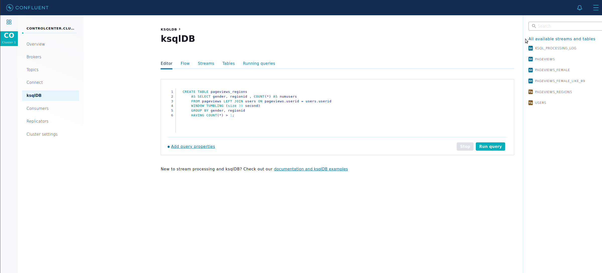

[](http://confluent.io)

# Quick Start for Apache Kafka using Confluent Platform

Use this quick start to get up and running with Confluent Platform and
its main components in a development environment. This quick start uses
Confluent Control Center included in Confluent Platform for topic
management and event stream processing using ksqlDB.

In this quick start, you create Apache Kafka® topics, use Kafka Connect
to generate mock data to those topics, and create ksqlDB streaming
queries on those topics. You then go to Control Center to monitor and
analyze the streaming queries.

## Step 1: Start Confluent Platform

Start Confluent Platform using the Confluent CLI [confluent local services start](/confluent-cli/current/command-reference/local/services/confluent_local_services_start.html)
command. This command starts all of the Confluent Platform components, including Kafka, ZooKeeper, Schema Registry, HTTP RESTProxy for Kafka, Kafka Connect, ksqlDB, and Control Center. Type the following in your terminal:

    start-kafka.sh

Your output should resemble:

    Starting Zookeeper
    Zookeeper is [UP]
    Starting Kafka
    Kafka is [UP]
    Starting Schema Registry
    Schema Registry is [UP]
    Starting Kafka REST
    Kafka REST is [UP]
    Starting Connect
    Connect is [UP]
    Starting KSQL Server
    KSQL Server is [UP]
    Starting Control Center
    Control Center is [UP]

## Step 2: Create Kafka Topics

In this step, you create Kafka topics using [Confluent Control Center]. Confluent Control Center provides the functionality for building and monitoring production data pipelines and event streaming applications.

1. Navigate to the Control Center web interface at
   <http://localhost:9021>.

   It may take a minute or two for Control Center to come online.

2. Select the `CO Cluster 1` cluster.

   

3. Click **Topics** from the cluster submenu and click **+ Add a
   topic**.

   

4. In the Topic name field, specify `pageviews` and click **Create with defaults**.

   

5. Click **Topics** from the cluster submenu and click **+ Add a
   topic**.

6. In the Topic name field, specify `users` and click **Create with defaults**.

## Step 3: Use a Kafka Connector to Generate Sample Data

In this step, you use Kafka Connect to run a demo source connector called `kafka-connect-datagen` that creates sample data for the Kafka topics `pageviews` and `users`.

1. Run the first instance of the [Kafka Connect
   Datagen](https://www.confluent.io/hub/confluentinc/kafka-connect-datagen/)
   connector to produce Kafka data to the `pageviews` topic in AVRO format.

   1. Select the `CO Cluster 1` cluster.

   2. Click **Connect**.

   3. Select the `connect-default` cluster in the All Connect Clusters table.

   4. Click **Add connector**.

   5. Select the `DatagenConnector` tile.

      > Tip: To narrow displayed connectors, click **Filter by type** and
      > click **Sources**.

   6. In the **Name** field, specify `datagen-pageviews`.

   7. After naming the connector, new fields appear. Scroll down and
      specify the following configuration values:

      - In **Key converter class**, specify `org.apache.kafka.connect.storage.StringConverter`.
      - In **kafka.topic**, specify `pageviews`.
      - In **max.interval**, specify `100`.
      - In **quickstart**, specify `pageviews`.

   8. Click **Continue**.

   9. Review the connector configuration and click **Launch**.

   

2. Run the second instance of the [Kafka Connect Datagen](https://www.confluent.io/hub/confluentinc/kafka-connect-datagen/) connector to produce Kafka data to the `users` topic in AVRO format.

   1. Select the `CO Cluster 1` cluster.

   2. Click **Connect**.

   3. Select the `connect-default` cluster in the All Connect Clusters table.

   4. Click **+ Add connector**.

   5. Select the `DatagenConnector` tile.

      > Tip: To narrow displayed connectors, click **Filter by type** and
      > click **Sources**.

   6. In the **Name** field, specify `datagen-users`.

   7. After naming the connector, new fields appear. Scroll down and
      specify the following configuration values:

      - In **Key converter class**, specify
        `org.apache.kafka.connect.storage.StringConverter`.
      - In **kafka.topic**, specify `users`.
      - In **max.interval**, specify `1000`.
      - In **quickstart**, specify `users`.

   8. Click **Continue**.

   9. Review the connector configuration and click **Launch**.

   

## Step 4: Create and Write to a Stream and Table using ksqlDB

> Tip: You can also run these commands using the [ksqlDB CLI](../ksqldb/installing.html#install-ksql-cli) from your terminal with this command:
> `ksql http://localhost:8088`

### Create Streams and Tables

In this step, you use ksqlDB to create a stream for the `pageviews` topic and a table for the
`users` topic.

1. Select the `CO Cluster 1` cluster.
2. Click **ksqlDB**.
3. Select the `ksqlDB` application.
4. From the **ksqlDB EDITOR** page, in the **Streams** tab, click **+ Add Stream**.
5. Select the `pageviews` topic.
6. Choose your stream options:

   - In **Value format**, select `AVRO`.
   - In **Value column(s)**, set the fields as follows:
     - `viewtime` with type `BIGINT`
     - `userid` with type `VARCHAR`
     - `pageid` with type `VARCHAR`

7. Click **Save STREAM**.
8. In the **Tables** tab, click **Add a table**.
9. Select the `users` topic.
10. Choose your table options:

    - In **Value format**, select `AVRO`.
    - In **PRIMARY KEY column**, select `userid`.
    - In the **Value column(s)** section, set the fields as follows:
      - `registertime` with type `BIGINT`
      - `userid` with type `VARCHAR`
      - `regionid` with type `VARCHAR`
      - `gender` with type `VARCHAR`

11. Click **Save TABLE**.

### Write Queries

In this step, you create ksqlDB queries against the stream and the table you created above.

1. Select the `CO Cluster 1` cluster.

2. Click **ksqlDB**.

3. Select the `ksqlDB` application.

4. In the **Editor** tab, click **Add query properties** to add a custom query property.

5. Set the `auto.offset.reset` parameter to `Earliest`.

   This setting instructs ksqlDB queries to read all available topic
   data from the beginning. This configuration is used for each
   subsequent query. For more information, see the [ksqlDB
   Configuration Parameter Reference](https://docs.ksqldb.io/en/0.10.2-ksqldb/operate-and-deploy/installation/server-config/config-reference/).

6. Create the following queries.

   1. Create a non-persistent query that returns data from a stream
      with the results limited to a maximum of three rows:

      Enter the following query in the editor:

      ```sql
          SELECT pageid FROM pageviews EMIT CHANGES LIMIT 3;
      ```

   2. Click **Run query**. Your output should resemble:

      

      Click the **Card view** or **Table view** icon to change the
      output layout.

   3. Create a persistent query (as a stream) that filters `pageviews` stream for female
      users. The results from this query are written to the Kafka `PAGEVIEWS_FEMALE` topic:

      Enter the following query in the editor:

      ```sql
      CREATE STREAM pageviews_female
          AS SELECT users.userid AS userid, pageid, regionid, gender
          FROM pageviews LEFT JOIN users ON pageviews.userid = users.userid
          WHERE gender = 'FEMALE';
      ```

   4. Click **Run query**. Your output should resemble:

      

   5. Create a persistent query where the `regionid` ends with `8` or `9`. Results
      from this query are written to a Kafka topic named `pageviews_enriched_r8_r9`:

      Enter the following query in the editor:

      ```sql
      CREATE STREAM pageviews_female_like_89
          WITH (kafka_topic='pageviews_enriched_r8_r9', value_format='AVRO')
          AS SELECT * FROM pageviews_female
          WHERE regionid LIKE '%_8' OR regionid LIKE '%_9';
      ```

   6. Click **Run query**. Your output should resemble:

      

   7. Create a persistent query that counts the pageviews for each
      region and gender combination in a [tumbling
      window](../streams/developer-guide/dsl-api.html#windowing-tumbling)
      of 30 seconds when the count is greater than 1. Because the
      procedure is grouping and counting, the result is now a table,
      rather than a stream. Results from this query are written to a
      Kafka topic called `PAGEVIEWS_REGIONS`:

      Enter the following query in the editor:

      ```sql
      CREATE TABLE pageviews_regions
          AS SELECT gender, regionid , COUNT(*) AS numusers
          FROM pageviews LEFT JOIN users ON pageviews.userid = users.userid
          WINDOW TUMBLING (size 30 second)
          GROUP BY gender, regionid
          HAVING COUNT(*) > 1;
      ```

   8. Click **Run query**. Your output should resemble:

      

   9. Click the **Running queries** tab. You should see the following persisted queries:

      - PAGEVIEWS_FEMALE
      - PAGEVIEWS_FEMALE_LIKE_89
      - PAGEVIEWS_REGIONS

   10. Click the **Editor** tab. The **All available streams and
       tables** pane shows all of the streams and tables that you can
       access.

       

   11. In the **All available streams and tables** section, click
       **KSQL_PROCESSING_LOG** to view the stream’s schema, including
       nested data structures.

### Run Queries

In this step, you run the ksqlDB queries you save as streams and tables
above in the previous section.

1. Select the `CO Cluster 1` cluster.

2. Click **ksqlDB**.

3. Select the `ksqlDB` application.

4. In the **Streams** tab, select the `PAGEVIEWS_FEMALE` stream.

5. Click **Query stream**.

   Streaming output of the query displays.

6. Click **Stop** to stop the output generation.

7. In the **Tables** tab, select `PAGEVIEWS_REGIONS` table.

8. Click **Query table**.

   Streaming output of the query displays.

9. Click **Stop** to stop the output generation.

## Step 5: Monitor Consumer Lag

1. Select the `CO Cluster 1` cluster.
2. Click **Consumers** to view the consumers created by ksqlDB.
3. Click the consumer group ID to view details for the
   `_confluent-ksql-default_query_CSAS_PAGEVIEWS_FEMALE_0` consumer group.

From this page you can see the consumer lag and consumption values for
your streaming query.


For more information, see the Control Center [Consumers](https://docs.confluent.io/platform/current/control-center/consumers.html#controlcenter-userguide-consumers) documentation.

## Step 6: Stop Confluent Platform

When you are done working with this tutorial, you can stop Confluent Platform.

1.  Stop Confluent Platform:

        stop-kafka.sh

2.  Destroy the data in the Confluent Platform instance:.

        clear-kafka.sh
