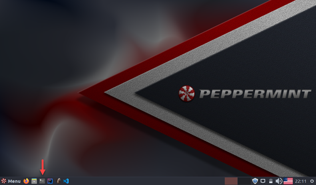
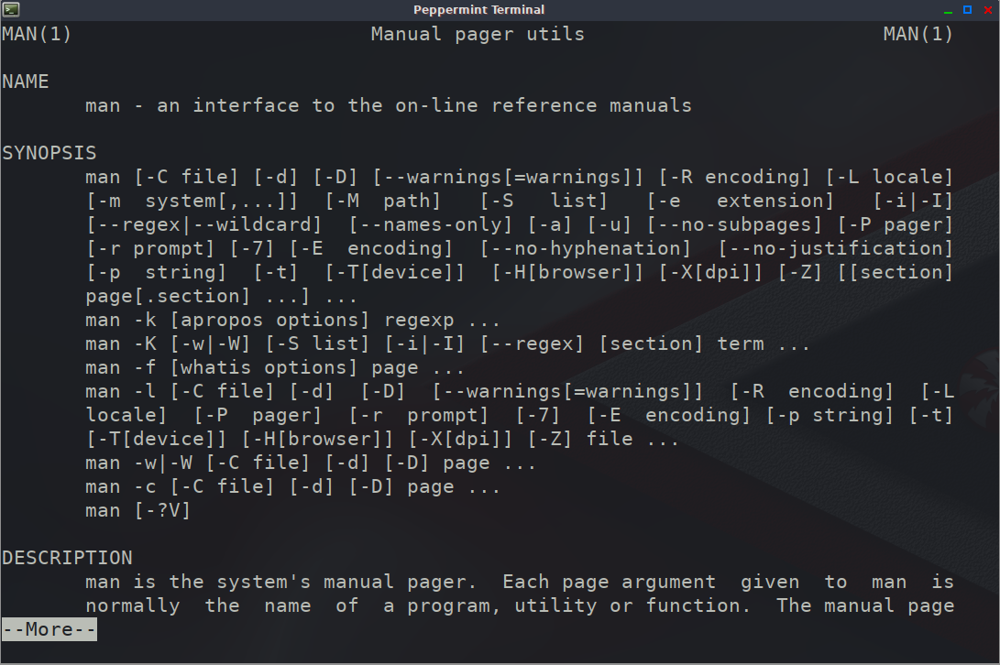

# Unix Command Line Interface (CLI)

We will now start learning Linux / Unix Command Line Interface (CLI). We will go through some basic commands to do a lot of useful things like exploring and managing the file system, process data, run scripts, control processes and so on...

First, let's start a terminal window, so click on the terminal button

A terminal window opens. This is where we will type the CLI commands

Let's examine some basic commands...

- ## **man**
  Display the manual pages with documentation about commands, system calls and other system functions

> You can run a sequence of commands using the special character '|' (pipe)
>
> For example, use '|' followed by the 'more' command to display the output of the initial command, one screen at a time.
>
> Press 'Enter' to scroll one line. To move to the next screen press 'space bar'. To return to the terminal prompt press 'q'

Example: **_man man | more_**

Show the documentation on the man command

Type _'man man | more'_ on the terminal prompt. The first screen of the documentation of the man command will appear.

    Navigate through the output by pressing 'space bar' or 'Enter'. Finally press ':q' to return to the terminal prompt

## Explore the file system contents

- ## **ls**

List the contents of a directory

Example 1: List the contents of the current directory

We can list contents of any file / directory (on which our user has the necessary permissions) by giving the corresponding path

> As with all Unix commands, we can specify many opton with 'ls' command using '-' character followed by the command option (to see the options and general documentation on any command use the 'man' command)

Example 2: Return a long listing (detailed output) of the contents of the 'Desktop' directory with 'user-friendly' file size of the 'example' directory. Type **_'ls -lh example'_**

A indication whether the line refers to directory (firs character is 'd'), permissions, owner and group the file / directory belongs to, its size and so on is the output of the command

- ## **cd**

Stands for change directory'. Move to another directory indicated by the path.

Example 1: Change directory to 'example/files'. Type 'cd example/files' on the terminal window

> _Relative paths_ can also be used. For example '~' designates the home directory of the current user

Example 1: Change directory to subdirectory 'pig' of the current user's home directory. Type 'cd ~/pig'

- ## **pwd**

Obtains the whole path of the current directory

## File System Management

- ## **mkdir**

Stands for 'make directory'. This command creates a new directory under the current directory or in the specified path

Example: Type the sequence of the following commands:

- 'cd ~' (change directory to the user's home directory)
- 'pwd' (check the current working directory)
- 'mkdir test_01' (create a new directory under the current directory)
- 'mkdir test_01/test_02' (create a new directory under the test_01 directory)
- 'ls -l test_01' (display the contents of the test_01 directory)

Directory 'test_01' was created and also its subdirectory 'test_02'

- ## **touch**

Updates the access and modification times of its arguments to the current time

Example: Type the sequence of the following commands:

- 'touch test_01/new_file_01' (create a new file new_file_01 in the directory test_01)
- 'ls -l --full-time test_01' (also display the full modification time)
- 'touch test_01/new_file_01' (update the access and modification time of new_file_01)
- 'ls -l --full-time test_01'

Notice the difference in the modification time of 'new_file_01'

- ## **cp**

Creates copies of files or directories with source and target location specified as the arguments

Example: Type the sequence of the following commands:

- 'cp test_01/new_file_01 test_01/test_02/new_file_02' (creates a copy of new_file_01 with name new_file_02 in the direcory test_02)
- 'ls -lR test_01' (display the contents fo test_01 and its subdirectories)
- 'cp -r test_01/test_02 test_01/test_03' (copy directory 'test_02' with all its contents to directory 'test_03' recursively)
- 'ls -lR test_01' (everything is copied to directory 'test_03')

- ## **mv**

Moves or renames the files or directories from the source to target specified in the arguments

Example: Type the sequence of the following commands:

- 'mv test_01/test_03/new_file_02 test_01/test_03/new_file_03' (renames new_file_02 to new_file_03 in the direcory test_01/test_03)
- 'ls -lR test_01' (display the contents fo test_01 and its subdirectories)

- ## **rm**

Deletes (removes) files or directories from the file system.

> Be **VERY careful** when using the **'rm'** command. Especially when used with option **'-r'** which will recursively delete the directory given as argument with all its contents

Example: Type the sequence of the following commands:

- 'cp test_01/test_03/new_file_03 test_01/test_03/new_file_04' (create a copy of new_file_03 to new_file_04 in the direcory test_01/test_03)
- 'ls -lR test_01' (display the contents fo test_01 and its subdirectories)
- 'rm test_01/test_03/new_file_04' (delete file new_file_04 in the direcory test_01/test_03)
- 'ls -lR test_01' (the file new_file_04 has been removed)
- rm -r test_01/test_03 (recursively remove the directory test_03 and all its contents)
- 'ls -lR test_01' (the whole directory test_03 has been removed)

## Exploring File Content

For this section we will be using the file 'near-earth-comets.csv'. This file (dataset) provides orbital data for small Solar System bodies whose orbits are relatively close to Earth. For more information, visit <https://www.kaggle.com/nasa/near-earth-comets>

- ## **head**

  Outputs the top of a file. We can specify the number of lines to output.

  Example: Display the first five lines of a file.

  Type 'head -n 5 Various-Data/near-earth-comets.csv' in a terminal window

- ## **tail**

  Outputs the bottom of a file. We can specify the number of lines to output.

  Example: Display the last five lines of a file.

  Type 'tail -n 5 Various-Data/near-earth-comets.csv' in a terminal window

In order to view all the lines starting from a specific line, you can use the '+' option

Example: Combine the commands 'head' and 'tail' to display the lines 12 to 15 of a file

Type 'head -n 15 Various-Data/near-earth-comets.csv | tail -n +12' in a terminal window

The head command outputs the first 15 lines of a file. And the output is redirected with '|' to the tail command to fetch the last lines of the output starting from line 12

- ## **more**

  Outputs the contents of a file one screen at a time without loading the whole file into memory

  Example: Type 'more Various-Data/near-earth-comets.csv' in a terminal window

  Press space bar to load the next portion of the file or 'q' to exit

- ## **less**

  Very similar to 'more' command but, outputs the contents of a file one screen at a time without loading the whole file into memory. But it has many more features than 'more'. I suggest you read the manual for more info

  Example: Type 'less Various-Data/near-earth-comets.csv' in a terminal window

  Press space bar to load the next portion of the file or 'q' to exit

- ## **wc**

  Ouputs statistics about a file (number of lines, words, characters). To limit the information you can use use specific options (e.g. -c outputs the number of characters)

  Example: Type 'wc Various-Data/near-earth-comets.csv' in a terminal window

  The file has 161 lines (number of new line characters), 455 words (sequence of characters separated by white space) and 25402 characters

## Process Examination

The following commands are used to check and control the processes running on the system.

- ## **ps**

  Outputs a snapshot of the processes currently running on the system. There are plenty of options that can be used with this command. If you run the command with no arguments, it displays the processes of the current shell.

  Example: Type 'ps -ef | more' in a terminal window

  A full detailed format listing with the commands of all running processes are displayed on the terminal

- ## **top**

  Outputs a dynamic real-time view of the running system. There are two areas of information in its output.
  The dashboard area where general information about the system and the process-list area with information about running processes. By default, the output is updated every three seconds. To stop the command, just press 'q'

  Example: Type 'top' in a terminal window

- ## **kill**

  Sends a signal to process which terminates the process. You should **very very careful** when using this command.

  Example:

  - Start a new terminal window
    
    You should have two open terminals now
  - In the first terminal, run the top command
    

  - In the other terminal, execute the following:

    1. Run 'ps -af | more'

       Option -a of ps: Output all processes except session leaders (processes that are not a child of another process i.e. PID is equal to PPID in ps output) and processes not associated with a terminal

       

    2. Type 'kill -9 \<top PID> (get the process id (PID) of the 'top' command and send a kill signal (option -9) with the kill command)

       

    Now the 'top' command is terminated. Again, this command should be used with **CAUTION**

    

In this session, we just scratch the surface of the enormous wealth of capabilties that Unix CLI provides. You can find an appropriate CLI command for almost every task that you need to perform on your system. And each command has its own specific options to help you accomplish your task faster and more efficiently.
