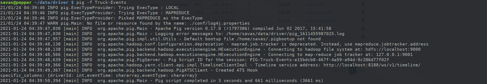

# Beginners Guide to Apache Pig

## [Introduction](#introduction)

In this tutorial you will gain a working knowledge of Pig through the
hands-on experience of creating Pig scripts to carry out essential data
operations and tasks.

We will first read in two data files that contain driver data
statistics, and then use these files to perform a number of Pig
operations including:

- Define a relation with and without `schema`
- Define a new relation from an `existing relation`
- `Select` specific columns from within a relation
- `Join` two relations
- Sort the data using `‘ORDER BY’`
- FILTER and Group the data using `‘GROUP BY’`

## [Outline](#outline)

- [What is Pig?](#what-is-pig)
- [Start the services](#start-the-services)
- [Download the Data](#download-the-data)
- [Upload the data files](#-upload-the-data-files)
- [Create Your Script](#create-your-script)
- [Define a relation](#define-a-relation)
- [Save and Execute the Script](#save-and-execute-the-script)
- [Define a Relation with a Schema](#define-a-relation-with-a-schema)
- [Define a new relation from an existing
  relation](#define-a-new-relation-from-an-existing-relation)
- [View the Data](#view-the-data)
- [Select specific columns from a
  relation](#select-specific-columns-from-a-relation)
- [Store relationship data into a HDFS
  File](#store-relationship-data-into-a-hdfs-file)
- [Perform a join between 2
  relations](#perform-a-join-between-2-relations)
- [Sort the data using “ORDER BY”](#sort-the-data-using-order-by)
- [Filter and Group the data using “GROUP
  BY”](#filter-and-group-the-data-using-group-by)
- [Further Reading](#further-reading)

## [What is Pig?](#what-is-pig)

`Pig` is a high level scripting language that is used with Apache
Hadoop. Pig enables data workers to write complex data transformations
without knowing Java. Pig’s simple SQL-like scripting language is called
Pig Latin, and appeals to developers already familiar with scripting
languages and SQL.

Pig is complete, so you can do all required data manipulations in Apache
Hadoop with Pig. Through the User Defined Functions(UDF) facility in
Pig, Pig can invoke code in many languages like JRuby, Jython and Java.
You can also embed Pig scripts in other languages. The result is that
you can use Pig as a component to build larger and more complex
applications that tackle real business problems.

Pig works with data from many sources, including structured and
unstructured data, and store the results into the Hadoop Data File
System.

Pig scripts are translated into a series of MapReduce jobs that are run
on the Apache Hadoop cluster.

## [Start the services](#start-the-services)

Start the needed services by running the following command on your terminal:

```
start-hive.sh
```

## [Download the Data](#download-the-data)

Download the driver data file [from
here](https://www.cloudera.com/content/dam/www/marketing/tutorials/beginners-guide-to-apache-pig/assets/driver_data.zip).
Once you have the file you will need to unzip the file into a directory.
We will be uploading two csv files - `truck_event_text_partition.csv`
and `drivers.csv`.

## [Upload the data files](#upload-the-data-files)

To upload the data files to HDFS issue the following commands on your terminal:

```
hdfs dfs -put truck_event_text_partition.csv /pig_data
hdfs dfs -put drivers.csv /pig_data
```

Check that the files are uploaded to HDFS:

```
hdfs dfs -ls /pig_data/*.csv
```

Alternatively, you can navigate in your browser to http://localhost:50070/explorer.html#/pig_data and check that the files are there.

## [Create Your Script](#create-your-script)

> Note: In this tutorial `nano` is used; however, any text editor will work
> as long as the files we create are stored on HDFS.

Create a new file where we will create the Pig Script:

```
nano Truck-Events
```

## [Define a relation](#define-a-relation)

In this step, you will create a script to load the data and define a
relation.

- On line 1 define a relation named `truck_events` that represents all
  the truck events
- On line 2 use the `DESCRIBE` command to view the `truck_events`
  relation

The completed code will look like:

```
truck_events = LOAD '/pig_data/truck_event_text_partition.csv' USING PigStorage(',');
DESCRIBE truck_events;
```

> **Note:** In the LOAD script, you can choose any directory path.
> Verify the folders have been created in HDFS Files View.

## [Save and Execute the Script](#save-and-execute-the-script)

To save your changes while on `nano` press `Ctrl+X` and type `y` then enter.

To execute the script and submit the file we just created to pig:

```
pig -f Truck-Events
```

This action creates one or more MapReduce jobs. After a moment, the
script starts and the page changes.

When the job completes, you can see the result output. Notice truck_events does not
have a schema because we did not define one when loading the data into
relation truck_events.


## [Define a Relation with a Schema](#define-a-relation-with-a-schema)

Let’s use the above code but this time with a schema. Modify line 1 of
your script and add the following `AS` clause to define a schema for the
truck events data. Open `nano` and enter the following script:

```
truck_events = LOAD '/pig_data/truck_event_text_partition.csv' USING PigStorage(',') AS (driverId:int, truckId:int, eventTime:chararray, eventType:chararray, longitude:double, latitude:double, eventKey:chararray, correlationId:long, driverName:chararray, routeId:long,routeName:chararray,eventDate:chararray);
DESCRIBE truck_events;
```

Save and execute the script again.

> Note: Recall that we used `Ctrl+X` to save the script and
> `pig -f Truck-Events` to run the job.

This time you should see the schema for the truck_events relation:


## [Define a new relation from an existing relation](#define-a-new-relation-from-an-existing-relation)

You can define a new relation based on an existing one. For example,
define the following truck_events_subset relation, which is a
collection of 100 entries (arbitrarily selected) from the truck_events
relation. Add the following line to the end of your code:

```
truck_events_subset = LIMIT truck_events 100;
DESCRIBE truck_events_subset;
```

Save and execute the code. Notice `truck_events_subset` has the same
schema as `truck_events`, because `truck_events_subset` is a subset of
`truck_events` relation.


## [View the Data](#view-the-data)

To view the data of a relation, use the `DUMP` command. Add the
following `DUMP` command to your Pig script, then save and execute it
again:

```
DUMP truck_events_subset;
```

The command requires a MapReduce job to execute, so you will need to
wait a bit for the job to complete. The output should be 100
entries from the contents of `truck_events_text_partition.csv` (and not
necessarily the ones shown below, because again, entries are arbitrarily
chosen):


## [Select specific columns from a relation](#select-specific-columns-from-a-relation)

Delete the `DESCRIBE truck_events`, `DESCRIBE truck_events_subset` and
`DUMP truck_events_subset` commands from your Pig script; you will no
longer need those. One of the key uses of Pig is data transformation.
You can define a new relation based on the fields of an existing
relation using the `FOREACH` command. Define a new relation
`specific_columns`, which will contain only the `driverId`, `eventTime`
and `eventType` from relation `truck_events_subset`. Now the completed
code is:

```
truck_events = LOAD '/pig_data/truck_event_text_partition.csv' USING PigStorage(',') AS (driverId:int, truckId:int, eventTime:chararray, eventType:chararray, longitude:double, latitude:double, eventKey:chararray, correlationId:long, driverName:chararray, routeId:long,routeName:chararray,eventDate:chararray);
truck_events_subset = LIMIT  truck_events 100;
specific_columns = FOREACH truck_events_subset GENERATE driverId, eventTime, eventType;
DESCRIBE specific_columns;
```

Save and execute the script and your output will look like the
following:



## [Store relationship data into a HDFS File](#store-relationship-data-into-a-hdfs-file)

In this step, you will use the `STORE` command to output a relation into
a new file in HDFS. Enter the following command to output the
`specific_columns` relation to a folder named `output/specific_columns`:

```
STORE specific_columns INTO 'output/specific_columns' USING PigStorage(',');
```

> Note: Before you execute the pig script make sure the `output` folder does not already exist in HDFS. If it does then run the following command to remove it:

```
hdfs dfs -rm -r output/specific_columns
```

Save and Execute the script. Again, this requires a MapReduce job (just
like the DUMP command), so you will need to wait a bit for the job to
complete.

Once the job is finished, go to http://localhost:50070/explorer.html#/ and look for a newly
created folder called `“output”` under `/user/savas`. Click on `“output”` folder. You will find a sub-folder named `“specific_columns”`. Click on `“specific_columns”` folder. You will see an output file called `“part-r-00000”`:

> **Note:** If you didn't use the default path above, then the new
> folder will exist in the path you created.


Click on the file `“part-r-00000”` and then click on `Download` :


Save the file in your `Downloads` folder and open it with a text editor.

You can also view the contents of the file in HDFS by issuing the following command:

```
hdfs dfs -cat output/specific_columns/part-r-00000
```


## [Perform a join between 2 relations](#perform-a-join-between-2-relations)

In this step, you will perform a `join` on two driver statistics data
sets: `truck_event_text_partition.csv` and the `drivers.csv` files.
The file `drivers.csv` has all the details for the driver like driverId, name, ssn,
location, etc.

You have already defined a relation for the events named truck_events.
Create a new Pig script named `“Pig-Join”`. Then define a new relation
named `drivers` then join truck_events and drivers by `driverId` and
describe the schema of the new relation `join_data`. The completed code
will be:

```
truck_events = LOAD '/pig_data/truck_event_text_partition.csv' USING PigStorage(',') AS (driverId:int, truckId:int, eventTime:chararray, eventType:chararray, longitude:double, latitude:double, eventKey:chararray, correlationId:long, driverName:chararray, routeId:long,routeName:chararray,eventDate:chararray);
drivers =  LOAD '/pig_data/drivers.csv' USING PigStorage(',') AS (driverId:int, name:chararray, ssn:chararray, location:chararray, certified:chararray, wage_plan:chararray);
join_data = JOIN  truck_events BY (driverId), drivers BY (driverId);
DESCRIBE join_data;
```

Save the script and execute it:

```
pig -f Pig-Join | tee -a joinAttributes.txt
cat joinAttributes.txt
```


Notice `join_data` contains all the fields of both `truck_events` and
`drivers`.

## [Sort the data using “ORDER BY”](#sort-the-data-using-order-by)

Use the `ORDER BY` command to sort a relation by one or more of its
fields. Create a new Pig script named `“Pig-Sort”` from maria_dev home
directory enter:

```
nano Pig-Sort
```

Next, enter the following commands to sort the drivers data by name then
date in ascending order:

```
drivers =  LOAD '/pig_data/drivers.csv' USING PigStorage(',') AS (driverId:int, name:chararray, ssn:chararray, location:chararray, certified:chararray, wage_plan:chararray);
ordered_data = ORDER drivers BY name asc;
DUMP ordered_data;
```

Save and execute the script.

```
pig -f Pig-Sort | tee -a ordered_data.txt
```

Your output should be sorted as shown here:


## [Filter and Group the data using “GROUP BY”](#filter-and-group-the-data-using-group-by)

The `GROUP` command allows you to group a relation by one of its fields.
Create a new Pig script named `“Pig-Group”`. Then, enter the following
commands, which group the `truck_events` relation by the `driverId` for
the `eventType` which are not ‘Normal’.

```
truck_events = LOAD '/pig_data/truck_event_text_partition.csv' USING PigStorage(',') AS (driverId:int, truckId:int, eventTime:chararray, eventType:chararray, longitude:double, latitude:double, eventKey:chararray, correlationId:long, driverName:chararray, routeId:long,routeName:chararray,eventDate:chararray);
filtered_events = FILTER truck_events BY NOT (eventType MATCHES 'Normal');
grouped_events = GROUP filtered_events BY driverId;
DESCRIBE grouped_events;
DUMP grouped_events;
```

Save and execute the script.

```
pig -f Pig-Group | tee -a grouped_events.txt
```

Notice that the data for eventType which
are not Normal is grouped together for each driverId.


The results of the Pig Job will show all non-Normal events grouped under
each driverId.

Congratulations! You have successfully completed the tutorial and well
on your way to pigging on Big Data.

## [Further Reading](#further-reading)

- [Welcome to Apache Pig!](https://pig.apache.org/)
- [Pig Latin
  Basics](https://pig.apache.org/docs/r0.12.0/basic.html)
- [Pig Tutorial](https://www.tutorialspoint.com/apache_pig/index.htm)
