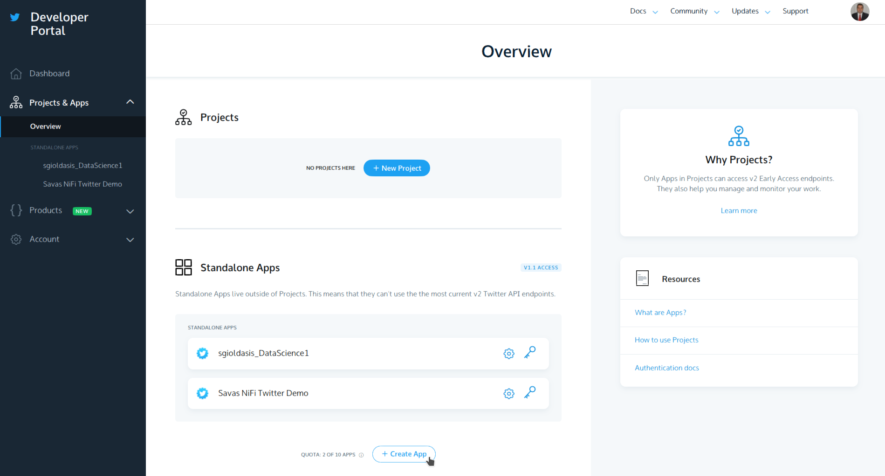

# Apache Spark Streaming Tutorial: Identifying Trending Twitter Hashtags

Nowadays, data is growing and accumulating faster than ever before.
Currently, around 90% of all data generated in our world was generated
only in the last two years. Due to this staggering growth rate, big data
platforms had to adopt radical solutions in order to maintain such huge
volumes of data.

One of the main sources of data today are social networks. Allow me to
demonstrate a real-life example: dealing, analyzing, and extracting
insights from social network data in real time using one of the most
important big data solutions out there Apache Spark and Python.

In this tutorial, we will build a simple application that
reads online streams from Twitter using Python, then processes the
tweets using Apache Spark Streaming to identify hashtags and, finally,
returns top trending hashtags.

## Creating Your Own Credentials for Twitter APIs

In order to get tweets from Twitter, you need to register on
[TwitterApps](https://apps.twitter.com/) by clicking on “Create new app”
and then fill the form click on “Create your Twitter app.”



Second, go to your newly created app and open the “Keys and Access
Tokens” tab. Then click on “Generate my access token.”

Your new access tokens will appear.

And now you’re ready for the next step.

## Building the Twitter HTTP Client

In this step, we will build a simple client that will get
the tweets from Twitter API using Python and passes them to the Spark
Streaming instance. It should be easy to follow for anyone with a little knowledge of Python.

First, let’s create a file called `twitter_app.py` and then we’ll add
the code in it together as below.

Import the libraries that we’ll use as below:

```py
import time
import socket
import sys
import requests
import requests_oauthlib
import json
```

And add the variables that will be used in OAuth for connecting to
Twitter as below:

```py
# Replace the values below with yours
ACCESS_TOKEN = 'YOUR_ACCESS_TOKEN'
ACCESS_SECRET = 'YOUR_ACCESS_SECRET'
CONSUMER_KEY = 'YOUR_CONSUMER_KEY'
CONSUMER_SECRET = 'YOUR_CONSUMER_SECRET'
my_auth = requests_oauthlib.OAuth1(CONSUMER_KEY, CONSUMER_SECRET, ACCESS_TOKEN, ACCESS_SECRET)
```

Now, we will create a new function called `get_tweets` that will call
the Twitter API URL and return the response for a stream of tweets.

```py
def get_tweets():
    url = 'https://stream.twitter.com/1.1/statuses/filter.json'
    query_data = [('language', 'en'), ('locations', '-130,-20,100,50'),('track','iphone')]
    query_url = url + '?' + '&'.join([str(t[0]) + '=' + str(t[1]) for t in query_data])
    response = requests.get(query_url, auth=my_auth, stream=True)
    print(query_url, response)
    return response
```

Then, create a function that takes the response from the above one and
extracts the tweets’ text from the whole tweets’ JSON object. After
that, it sends every tweet to Spark Streaming instance (will be
discussed later) through a TCP connection.

```py
def send_tweets_to_spark(http_resp, tcp_connection):
    for line in http_resp.iter_lines():
        time.sleep(.5)
        full_tweet = json.loads(line)
        tweet_text = full_tweet['text']
        print("Tweet Text: " + tweet_text)
        print ("------------------------------------------")
        msg = tweet_text + '\n'
        tcp_connection.send(msg.encode())
```

Now, we’ll make the main part which will make the app host socket
connections that spark will connect with. We’ll configure the IP here to
be `localhost` as all will run on the same machine and the port `50002`.
Then we’ll call the `get_tweets` method, which we made above, for
getting the tweets from Twitter and pass its response along with the
socket connection to `send_tweets_to_spark` for sending the tweets to
Spark.

```py
TCP_IP = 'localhost'
TCP_PORT = 50002
conn = None
s = socket.socket(socket.AF_INET, socket.SOCK_STREAM)
s.bind((TCP_IP, TCP_PORT))
s.listen(1)
print("Waiting for TCP connection...")
conn, addr = s.accept()
print("Connected... Starting getting tweets.")
resp = get_tweets()
send_tweets_to_spark(resp, conn)
s.close()
```

## Setting Up Our Apache Spark Streaming Application

Let’s build up our Spark streaming app that will do real-time processing
for the incoming tweets, extract the hashtags from them, and calculate
how many hashtags have been mentioned.


First, we have to create an instance of Spark Context `sc`, then we
create the Streaming Context `ssc` from `sc` with a batch interval two
seconds that will do the transformation on all streams received every
two seconds. Notice we have set the log level to `ERROR` in order to
disable most of the logs that Spark writes.

We define a checkpoint here in order to allow periodic RDD
checkpointing; this is mandatory to be used in our app, as we’ll use
stateful transformations (will be discussed later in the same section).

Then we define our main DStream dataStream that will connect to the
socket server we created before on port `50002` and read the tweets from
that port. Each record in the DStream will be a tweet.

```py
from pyspark import SparkConf,SparkContext
from pyspark.streaming import StreamingContext
from pyspark.sql import Row,SQLContext
import sys
import requests

# create spark configuration
conf = SparkConf()
conf.setAppName("TwitterStreamApp")
conf.setMaster("local[2]")
# create spark context with the above configuration
sc = SparkContext(conf=conf)
# Set log level to ERROR
sc.setLogLevel("ERROR")

# create the Streaming Context from the above spark context with interval size 2 seconds
ssc = StreamingContext(sc, 2)
# setting a checkpoint to allow RDD recovery
ssc.checkpoint("file:///tmp/checkpoint_TwitterApp")
# read data from port 50002
dataStream = ssc.socketTextStream("localhost", 50002)
```

Now, we’ll define our transformation logic. First we’ll split all the
tweets into words and put them in words RDD. Then we’ll filter only
hashtags from all words and map them to pair of `(hashtag, 1)` and put
them in hashtags RDD.

Then we need to calculate how many times the hashtag has been mentioned.
We can do that by using the function `reduceByKey`. This function will
calculate how many times the hashtag has been mentioned per each batch,
i.e. it will reset the counts in each batch.

In our case, we need to calculate the counts across all the batches, so
we’ll use another function called `updateStateByKey`, as this function
allows you to maintain the state of RDD while updating it with new data.
This way is called `Stateful Transformation`.

Note that in order to use `updateStateByKey`, you’ve got to configure a
checkpoint, and that what we have done in the previous step.

```py
# split each tweet into words
words = dataStream.flatMap(lambda line: line.split(" "))
# filter the words to get only hashtags, then map each hashtag to be a pair of (hashtag,1)
hashtags = words.filter(lambda w: '#' in w).map(lambda x: (x, 1))
# adding the count of each hashtag to its last count
tags_totals = hashtags.updateStateByKey(aggregate_tags_count)
# do processing for each RDD generated in each interval
tags_totals.foreachRDD(process_rdd)

# start the streaming computation
ssc.start()
# wait for the streaming to finish
ssc.awaitTermination()
```

The `updateStateByKey` takes a function as a parameter called the
`update` function. It runs on each item in RDD and does the desired
logic.

In our case, we’ve created an update function called
`aggregate_tags_count` that will sum all the `new_values` for each
hashtag and add them to the `total_sum` that is the sum across all the
batches and save the data into `tags_totals` RDD.

```py
def aggregate_tags_count(new_values, total_sum):
    return sum(new_values) + (total_sum or 0)
```

Then we do processing on `tags_totals` RDD in every batch in order to
convert it to temp table using Spark SQL Context and then perform a
select statement in order to retrieve the top ten hashtags with their
counts and put them into `hashtag_counts_df` data frame.

```py
def get_sql_context_instance(spark_context):
    if ('sqlContextSingletonInstance' not in globals()):
        globals()['sqlContextSingletonInstance'] = SQLContext(spark_context)
    return globals()['sqlContextSingletonInstance']

def process_rdd(time, rdd):
    print("----------- %s -----------" % str(time))
    if not rdd.isEmpty():
        # Get spark sql singleton context from the current context
        sql_context = get_sql_context_instance(rdd.context)
        # convert the RDD to Row RDD
        row_rdd = rdd.map(lambda w: Row(hashtag=w[0], hashtag_count=w[1]))
        # create a DF from the Row RDD
        hashtags_df = sql_context.createDataFrame(row_rdd)
        # Register the dataframe as table
        hashtags_df.registerTempTable("hashtags")
        # get the top 10 hashtags from the table using SQL and print them
        hashtag_counts_df = sql_context.sql("select hashtag, hashtag_count from hashtags order by hashtag_count desc limit 10")
        hashtag_counts_df.show()
```

Here is a sample output of the Spark Streaming while running
and printing the `hashtag_counts_df`, you’ll notice that the output is
printed exactly every two seconds as per the batch intervals.

```text
-------------------------------------------
Batch: 0
-------------------------------------------
+----+-----+
|word|count|
+----+-----+
+----+-----+

-------------------------------------------
Batch: 1
-------------------------------------------
+-------+-----+
|   word|count|
+-------+-----+
|#TikTok|    1|
+-------+-----+

-------------------------------------------
Batch: 2
-------------------------------------------
+--------------------+-----+
|                word|count|
+--------------------+-----+
|             #TikTok|    1|
|#PersonalResponsi...|    1|
|       #StudentLoans|    1|
+--------------------+-----+
```

## Running the applications together

To run the applications we have prepared some bash scripts.

The first one is called `run-app.sh`:

```bash
#!/bin/bash

set -e

python3 twitter_app.py
```

The second one is called `run-spark-streaming.sh`:

```bash
#!/bin/bash

set -e

rm -rf /tmp/checkpoint*

spark-submit spark_structured.py
```

Let’s run the applications in the order below:

1. Twitter App (on one terminal) : `./run-app.sh`
2. Spark App (on a second terminal) : `./run-spark-streaming.sh`

Now, you can see tweet texts being output on your first terminal and hashtag counts being printed on your second terminal. To terminate both applications you type `Ctrl+C` on your second terminal (the one running the Spark application).

## Spark Structured Streaming

For comparison, we have also implemented the Spark application using the new [Spark Structured Streaming](https://spark.apache.org/docs/latest/structured-streaming-programming-guide.html). You can decide for yourselves which style you prefer. Here is the code:

```py
from pyspark.sql import SparkSession
from pyspark.sql.functions import explode
from pyspark.sql.functions import split

spark = SparkSession \
    .builder \
    .master("local[2]") \
    .appName("StructuredNetworkWordCount") \
    .getOrCreate()

# Create DataFrame representing the stream of input lines from connection to localhost:50003
lines = spark \
    .readStream \
    .format("socket") \
    .option("host", "localhost") \
    .option("port", 50002) \
    .load()

# Split the lines into words
words = lines.select(
   explode(
       split(lines.value, " ")
   ).alias("word")
)

# Generate running word count for hashtags
wordCounts = words \
    .filter("word like '%#%'") \
    .groupBy("word") \
    .count() \
    .orderBy('count', ascending=False)

# Start running the query that prints the running counts to the console
query = wordCounts \
    .writeStream \
    .outputMode("complete") \
    .option("checkpointLocation", "file:///tmp/checkpoint_structured4") \
    .format("console") \
    .start()

query.awaitTermination()
```

## In-class Assignment 1 (C2)

In our implementation above, there is a major problem. Can you spot it?

The problem is that the `producer` (the Python application fetching the tweets) and the `consumer` (the Spark application analyzing the tweets) are `tightly coupled`. This means that both must be running together at the same time and at similar speeds. If they don't we will run into various issues.

So, how can we `de-couple` these two? We need some layer in-between so that the producer can run independently at its own speed and write the tweets to the intermediate layer. Then the consumer can run independently at its own speed, reading the tweets from the intermediate layer. This is the role of Kafka. Let's try using Kafka.

We first need to refactor our `producer` application in order to write to Kafka instead of a network socket. Here is the start of the new code:

```py
import time
import socket
import sys
import requests
import requests_oauthlib
import json
from confluent_kafka import Producer
```

> Exercise 1: Try to complete the above code by modifying the original implementation as needed.

Next, we need to refactor our `consumer` (structured streaming) application in order to read from Kafka instead of a network socket. Here is the start of the new code:

```py
from pyspark.sql import SparkSession
from pyspark.sql.functions import explode
from pyspark.sql.functions import split
from pyspark.sql.functions import regexp_replace

spark = SparkSession \
    .builder \
    .master("local[2]") \
    .appName("StructuredNetworkWordCount") \
    .getOrCreate()
```

> Exercise 2: Try to complete the above code by modifying the original implementation as needed.

In order to run our Spark application, we need to slightly change the run script in order to include the `spark-sql-kafka` package. Here is the new script:

```bash
#!/bin/bash

set -e

rm -rf /tmp/checkpoint*

spark-submit --packages org.apache.spark:spark-sql-kafka-0-10_2.12:3.0.1 kafka_spark_structured.py
```

Now, before we start any of our applications, we need to make sure that Kafka is running.

```bash
start-kafka.sh
```

After that, we can start/stop any of our two applications independently.

## Apache Streaming Real Life Use Cases

We’ve learned how to do simple data analytics on data in real time using
Spark Streaming. From this example, we can see how powerful
Spark is, as it captures a massive stream of data, transforms it, and
extracts valuable insights that can be used easily to make decisions in
no time. There are many helpful use cases that can be implemented and
which can serve different industries, like news or marketing.

### News industry example

> We can track the most frequently mentioned hashtags to know what
> topics people are talking about the most on social media. Also, we can
> track specific hashtags and their tweets in order to know what people
> are saying about specific topics or events in the world.

### Marketing example\*\*

> We can collect the stream of tweets and, by doing sentiment analysis,
> categorize them and determine people’s interests in order to target
> them with offers related to their interests.

Also, there are a lot of use cases that can be applied specifically for
big data analytics and can serve a lot of industries.

I encourage you to read more about Spark Streaming from
[here](http://spark.apache.org/docs/latest/streaming-programming-guide.html)
in order to know more about its capabilities and do more advanced
transformation on data for more insights in real time using it.
