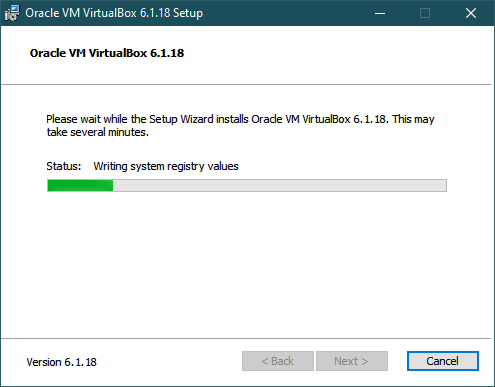

# Oracle VirtualBox installation and VM Set Up

## **Step 1: Download VirtualBox**

Start your browser and navigate to [virtualbox.org](https://www.virtualbox.org/)

Click on 'Download VirtualBox 6.1' (or the current version)

On the download page click the link for your operating system

> For this installation, **Windows 10** will be used as the host operating system

Download the installation executable to the directory of your choice

## **Step 2: Install VirtualBox**

Open the installation executable and click 'Next' on the following prompt:

Leave the installation options as they are and press 'Next':

Also leave the following options selected. Especially the 'Register file associations' option. Any files that are associated with VirtualBox will only open with VirtualBox.

Press 'Next'

The following step will install drivers for Internet access on VirtualBox and will disconnect from the Internet maybe for a few seconds.

Press 'Next'

Press 'Install' on the following prompt:

The installation will begin:

Also press ‘Install’ if a Windows Security prompt like the following appears

Let the installation finish. There is chance that it might take some time...

Press 'Finish' (leaving the option to start the Oracle VirtualBox selected)

That VirtualBox starts!

## **Step 3: VirtualBox Extension Pack Set Up**

It is recommended to install the Extension Pack. It will expand the capabilities of the Virtual Machine providing support for USB 2.0 and 3.0 (communication with USB peripherals of the host computer) and Host Webcam Support among other things.

Navigate again to the [VirtualBox downloads page](https://www.virtualbox.org/wiki/Downloads).

Click on 'All Supported Platforms' under 'Oracle VM VirtualBox Extension Pack'

Select 'Open With [VirtualBox Manager (default)]' and press 'OK'

This will automatically start VirtualBox (if not already open). Press Install

Scroll to the end and press 'Agree' to 'VirtualBox Extension Pack Personal Use and Evaluation License (PUEL)' screen

The installation will complete in seconds. Press 'OK'

### **Great Job! You have successfully installed Oracle VirtualBox!**

Next you will set up the provided Virtual Machine that you download from on VirtualBox...

## **Step 4: Virtual Machine Set Up**

Start VirtualBox

Press the 'New' button. It should look like this:

A popup screen appears:

If it does not appear automatically, press **'Expert Mode'**

Enter the configuration details of the new VM

> - A descriptive name
> - Operating System of the VM on the **'Type'** drop down list (Linux in this case)
> - The version of the operating system (_Ubuntu 64_)
> - The amount of memory that will be allocated to the VM

Finally, on the **'Hard disk'** section, select '_Use an existing virtual hard drive file_' and from the yellow folder icon select the **.vhd image** that you downloaded as follows:

Press the 'Add' button on the popup screen

and vavigate to the location that the **.vhd image** was downloaded and press 'Open'

On the next screen, highlight the VM and press 'Choose'

Press 'Create' on the next screen

The VM is created as it is shown bellow:

### **Starting the Virtual Machine**

To start the VM, press the **'Start'** arrow

The VM is starting...

After a short while the VM environment will appear

> **Full Screen Mode**
>
> By pressing _'Right Ctrl + F'_ you can switch between full screen and windowed mode

### **Stopping the Virtual Machine**

**After you have saved all your work**, open a terminal window:

Enter the command: **_shutdown now_** and press 'Enter'

Now the VM is stopped

## **Congratulations! You Virtual Machine is ready for use. HAPPY LEARNING!!**
